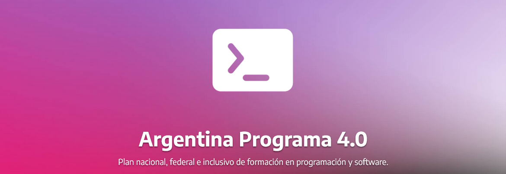

<h2 align="center">TP N°1 - C147 G9</h2>

  

---

 Primer trabajo práctico del Argentina programa 4.0, realizado por el grupo 9 de la comisión 147.
      

## 📝 Tabla de Contenidos

- [Información](#about)
- [Integrantes](#members)
- [Herramientas Utilizadas](#built_using)
<!--
- [Uso](#usage)
-->

---

## 🧐 Información 

Primer trabajo práctico del Argentina programa 4.0, realizado por el grupo 9 de la comisión 147 (Java Inicial). La consigna del trabajo práctico es el desarrollo de una programa de pronósticos deportivos a lo largo de tres entregas.

### Introducción

Un pronóstico deportivo consta de un posible resultado de un partido (que un equipo gane, pierda o empate), propuesto por una persona que está participando de una competencia contra otras. 
Cada partido tendrá un resultado. Este resultado se utilizará para otorgar puntos a los participantes de la competencia según el acierto de sus pronósticos. Finalmente, quien gane la competencia será aquella persona que sume mayor cantidad de puntos. 

### Consigna

La propuesta del trabajo práctico consiste en implementar un programa de consola que dada la información de resultados de partidos e información de pronósticos, ordene por puntaje obtenido a los participantes.

### Alcance

En este trabajo práctico nos limitaremos a pronosticar los resultados de los partidos, sin importar los goles ni la estructura del torneo (si es grupo, eliminatoria u otro); simplemente se sumarán puntos y se obtendrá un listado final.

---

## 😎 Integrantes 

<!-- TODO: Agregar a los integrantes del grupo. -->
...

<!--
---

## 🎈 Uso 

TODO: Agregar como se debe utilizar el programa.

-->
---

## ⛏️ Herramientas Utilizadas 

- [Java](https://www.java.com/) - Java 17
- [Maven](https://maven.apache.org/) - Apache Maven 3.9
- [Opencsv](https://opencsv.sourceforge.net/) - Opencsv 5.7.1
- [Lombok](https://projectlombok.org/) - Lombok 1.18.26
- [JUnit](https://junit.org/junit5/) - JUnit Jupiter 5.5.2
